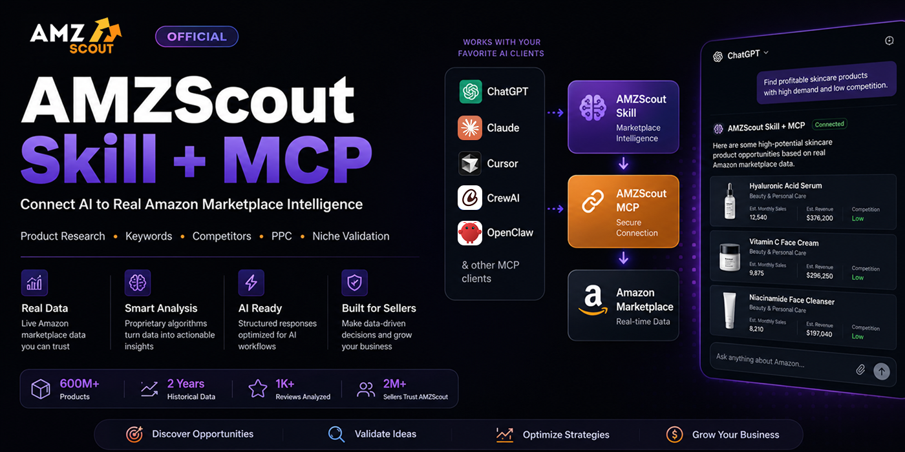

# Official AMZScout Skill + MCP for AI




[](https://smithery.ai/servers/support-mruz/amzscout-skill-mcp)

Connect your AI to **real Amazon marketplace data** with the official **AMZScout Skill + MCP**.

Get Access to AMZScout Skill + MCP here: https://learn.amzscout.net/amazon-product-api-for-ai-agents

Unlike a traditional MCP server that simply exposes APIs, AMZScout combines live marketplace data with proprietary analytical algorithms developed specifically for Amazon research. Instead of returning raw marketplace data, it delivers structured marketplace intelligence that AI assistants can immediately use to answer Amazon-related questions more accurately.

Whether you're validating product ideas, researching competitors, discovering keywords, optimizing listings, or building PPC campaigns, AMZScout helps your AI make data-driven decisions based on real Amazon marketplace data - not assumptions.

> [!IMPORTANT]
> AMZScout provides AI-powered marketplace analysis based on Amazon marketplace data. AI-generated responses are intended for informational purposes only. Please review the **Disclaimer** section below for important legal information.

---

## Table of Contents

- [Features](#features)
- [Supported AI Clients](#supported-ai-clients)
- [Supported Amazon Marketplaces](#supported-amazon-marketplaces)
- [Supported Capabilities](#supported-capabilities)
- [Available Tools](#available-tools)
- [Use Cases](#use-cases)
- [How It Works](#how-it-works)
- [Prompt Library](#prompt-library)
- [Quick Start](#quick-start)
- [Installation Guides](#installation-guides)
- [MCP Server](#mcp-server)
- [Support](#support)
- [Documentation](#documentation)
- [Disclaimer](#disclaimer)
- [License](#license)

---

## Features

- 📊 Real Amazon marketplace data
- 🔍 Product opportunity discovery
- 📈 Niche validation
- 🏆 Competitor analysis
- 🔑 Keyword research
- ✍️ Listing optimization
- 🎯 PPC strategy generation
- 💰 Sales estimates
- 📉 Historical marketplace trends
- 💵 Pricing analysis
- 🤖 AI-ready structured responses
- 🧠 Marketplace intelligence powered by AMZScout
- ⚡ Fast responses optimized for AI workflows

---

## Supported AI Clients

Officially supported AI clients:

- Claude
- ChatGPT (Plus and higher)
- Cursor
- CrewAI
- OpenClaw

> Other MCP-compatible AI clients are also supported.

---

## Supported Amazon Marketplaces

AMZScout provides marketplace data across all major Amazon marketplaces:

- 🇺🇸 United States
- 🇨🇦 Canada
- 🇲🇽 Mexico
- 🇧🇷 Brazil
- 🇬🇧 United Kingdom
- 🇩🇪 Germany
- 🇫🇷 France
- 🇮🇹 Italy
- 🇪🇸 Spain
- 🇦🇺 Australia
- 🇯🇵 Japan
- 🇮🇳 India
- 🇦🇪 United Arab Emirates
- 🇸🇦 Saudi Arabia

---

## Supported Capabilities

| Capability | Supported |
|------------|:---------:|
| Product Research | ✅ |
| Product Discovery | ✅ |
| Niche Validation | ✅ |
| Competitor Analysis | ✅ |
| Keyword Research | ✅ |
| Listing Optimization | ✅ |
| PPC Strategy | ✅ |
| Sales Estimates | ✅ |
| Pricing Analysis | ✅ |
| Historical Marketplace Trends | ✅ |
| AI-ready Structured Responses | ✅ |

---

# Available Tools

Full documentation for every tool is available in [`/tools`](./tools).

## Core Assistant

| Tool | Description |
|------|-------------|
| `amzscout-agent` | All-in-one natural-language Amazon research assistant that automatically selects the appropriate research workflow. |

## Product Research

| Tool | Description |
|------|-------------|
| `amzscout_analyze_product` | Retrieve complete marketplace data and insights for a single ASIN. |
| `amzscout_compare_products` | Compare 2–5 Amazon products side by side. |
| `amzscout_analyze_product_set` | Analyze and aggregate metrics across 2–100 ASINs. |
| `amzscout_search_products` | Search Amazon products by keyword using marketplace data. |
| `amzscout_find_by_brand` | Retrieve products published under a specific Amazon brand. |

## Market & Niche Research

| Tool | Description |
|------|-------------|
| `amzscout_analyze_niche` | Analyze demand, competition, pricing, and market health for a niche. |
| `amzscout_compare_niches` | Compare multiple Amazon niches side by side. |

## Keywords & SEO

| Tool | Description |
|------|-------------|
| `amzscout_get_keywords` | Discover SEO and PPC keywords with marketplace metrics. |

## Knowledge & Utilities

| Tool | Description |
|------|-------------|
| `amzscout_search_knowledge` | Search the AMZScout knowledge base. |
| `amzscout_recommend_tool` | Recommend the most appropriate AMZScout tool for a specific use case. |
| `amzscout_usage` | View your remaining token balance and usage statistics. |

---

## Use Cases

AMZScout Skill + MCP helps AI agents perform real Amazon marketplace research across every stage of the selling journey.

| Use Case | Description |
|----------|-------------|
| 🔍 Product Discovery | Find promising product opportunities using real marketplace data. |
| 📊 Niche Validation | Evaluate demand, competition, pricing, and seasonality before launching. |
| 🏆 Competitor Research | Analyze competing products, identify strengths and weaknesses, and benchmark performance. |
| 🔑 Keyword Research | Discover high-value keywords, search intent, and long-tail opportunities. |
| ✍️ Listing Optimization | Improve titles, bullet points, descriptions, and keyword coverage. |
| 📈 PPC Planning | Build launch and optimization strategies using keyword and competitor data. |
| 💰 Pricing Analysis | Compare prices, estimate sales potential, and identify pricing opportunities. |
| 📉 Market Intelligence | Analyze historical trends, emerging niches, and marketplace dynamics. |

---

## How It Works

Most MCP servers simply expose APIs and return raw marketplace data.

AMZScout adds an intelligence layer between Amazon marketplace data and your AI assistant.

AMZScout MCP data includes comprehensive Amazon product metrics, including estimated sales, revenue, pricing, profitability, listing quality, and competition-related data such as the number of sellers, seller types (FBA/FBM/Amazon), seller countries, and review counts. 

It also includes up to two years of historical price, sales, and revenue data, along with keyword metrics such as monthly search volume, cpc, and organic keyword rankings.

### Traditional MCP

```text
AI Agent
      │
      ▼
 MCP Server
      │
      ▼
 Amazon Marketplace Data
```

The AI receives raw marketplace data and must interpret everything independently.

### AMZScout Skill + MCP

```text
AI Agent
      │
      ▼
 AMZScout Skill
      │
      ▼
 AMZScout MCP
      │
      ▼
 Amazon Marketplace Data
```

Before marketplace data reaches the AI, the built-in AMZScout Skill evaluates marketplace signals using proprietary analytical algorithms.

Instead of raw data, your AI receives structured marketplace intelligence, including:

- Product insights
- Market validation
- Competitor analysis
- Keyword opportunities
- Pricing insights
- PPC insights
- Actionable business guidance

---

## Prompt Library

These prompts work in ChatGPT, Claude, Cursor, CrewAI, OpenClaw, and other MCP-compatible AI clients.

### Product Research

- Find profitable Amazon product opportunities with low competition.
- Suggest products under $40 that are lightweight and easy to source.
- Compare these product ideas and recommend the best one to launch.
- Find products with increasing demand and low competition.

### Niche Validation

- Validate this Amazon niche.
- Is this niche saturated?
- Analyze historical demand and seasonality.
- Estimate the difficulty of entering this market.

### Competitor Analysis

- Analyze ASIN B0XXXXXXXX.
- Compare this product against its top competitors.
- Identify competitor strengths and weaknesses.
- Find similar products with higher estimated sales.

### Keyword Research

- Find the best keywords for this product.
- Group keywords by search intent.
- Suggest long-tail keyword opportunities.
- Build a keyword strategy for a new listing.

### Listing Optimization

- Review my Amazon listing.
- Improve my product title.
- Rewrite my bullet points.
- Suggest missing keywords.
- Optimize this listing for search visibility.

### PPC Strategy

- Build a launch PPC strategy.
- Recommend campaign structure.
- Suggest keyword bidding priorities.
- Find ASINs for product targeting campaigns.

### Pricing & Profitability

- Estimate monthly sales.
- Analyze pricing trends over the past two years.
- Compare pricing with competitors.
- Estimate revenue potential.

### Market Intelligence

- Show historical sales trends.
- Compare the US and UK marketplaces.
- Find fast-growing Amazon niches.
- Identify emerging product opportunities.

---

## Quick Start

### Getting an API Key

Visit:

https://learn.amzscout.net/amazon-product-api-for-ai-agents

Choose the token plan that best fits your needs:

| Plan | Price | Product Analyses | Usage Period | Recommended for |
|------|-------|-------------------|--------------|------------------|
| **1M Tokens**  | $39                  | Up to 50    | 30 days | Getting started and light usage |
| **5M Tokens**  | ~~$195~~ **$99**     | Up to 250   | 30 days | Regular AI workflows |
| **20M Tokens** | ~~$780~~ **$199**    | Up to 1,000 | 30 days | High-volume usage and AI agents |

After completing your purchase, you'll receive an email containing:

- Your personal **API Key**
- Installation instructions for all supported AI clients

Use your API Key to connect AMZScout Skill + MCP to your preferred AI client and start researching Amazon with real Amazon marketplace data.

---

## Installation Guides

| AI Client | Installation Guide |
|-----------|--------------------|
| ChatGPT | https://learn.amzscout.net/how-to-install-skill-to-chatgpt |
| Claude | https://learn.amzscout.net/how-to-install-skill-to-claude |
| Cursor | https://learn.amzscout.net/how-to-install-skill-to-cursor |
| CrewAI | https://learn.amzscout.net/how-to-install-skill-to-crewai |

---

## MCP Server

### Server URL

```text
https://chatbot.amzscout.net/mcp
```

### Authentication

```text
API Key
```

---

## Support

If you have questions about installation, configuration, or using AMZScout Skill + MCP, we're happy to help.

📧 **support@amzscout.net**

---

## Documentation

Complete documentation, installation guides, tutorials, and additional resources are available at:

- https://learn.amzscout.net/amazon-product-api-for-ai-agents
- https://learn.amzscout.net/how-to-install-skill-to-ai-agent
- [`/tools`](./tools)

---

## Disclaimer

Data available through this service and AI-generated outputs are provided for informational purposes only and do not constitute professional or business advice.

Your use of the AI agent is governed by your agreement with its provider. AMZScout is not affiliated with, endorsed by, or sponsored by Amazon or the AI agent provider.

While AMZScout strives to provide accurate and up-to-date marketplace data, users are responsible for independently verifying information before making business decisions.

Your use of this service is at your own risk.

---

## License

This repository is licensed under the MIT License.

> [!NOTE]
> This repository contains documentation and integration examples only. The AMZScout Skill + MCP service is proprietary software provided as a hosted service by AMZScout.
